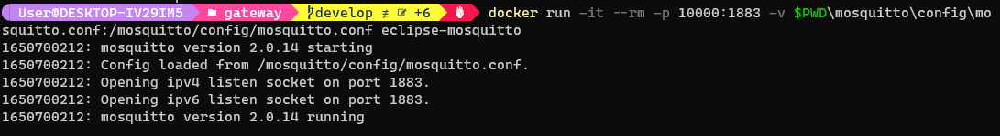

# Приступим к выполнению

--- 


## Подготовка в среде windows

Для генерации данных создадим модуль ***sensor.py***, в котором будет Определён базовый абстрактный класс ```Device``` 
и ```Sensor```, с абстрактными методами для их дальнейшего переопределения, значимые из них это:
- метод симуляции процесса сенсора (метод ```simulate_process```)
- метод получения данных с сенсора (метод ```get_data```)
...
- и др.

Далее определяем 4 типа датчика, это будут класы наследники Sensor:

- датчик температуры ```TemperatureSensor```
- датчик давления ```PressureSensor```
- датчик освещённости ```LightSensor```
- датчик ускорения ```AccelerometerSensor```

Кусочек кода:

```python
ACCELERATE = 20  # Accelerate processes in k times

class TemperatureSensor(Sensor):
def __init__(self, sensor_name: str):
    super().__init__(sensor_type="temperature_sensor",
                     sensor_name=sensor_name)

def simulate_process(self):
    time_stamp = datetime.datetime.time(datetime.datetime.now())
    time_sec = 24 * time_stamp.hour + 60 * time_stamp.minute + time_stamp.second
    time_sec *= ACCELERATE
    self.value = 4 * math.cos(time_sec * math.pi / 10000) - 10
```

Выполним проверку с выводом на консоль 


Далее настроим конфигурационный файл докер образа

```dockerfile
FROM python:3.9
WORKDIR /app
COPY requirements.txt .
RUN pip install -r requirements.txt
COPY . .
CMD ["python", "main.py"]
```

Выполним компиляцию докер-образа в windows powershell

```shell
$ docker build -t quteas/mqtt-sensor-simulator .
```
 
 


Для тетсов в среде windows запустим docker контейнер mqtt брокера mosquitto

```shell
$ docker run -it --rm -p 10000:1883 \
    -v $PWD\mosquitto\config\mosquitto.conf:/mosquitto/config/mosquitto.conf  eclipse-mosquitto broker
```

Конфигурационный файл ```mosquitto.conf```:

```yaml
listener 1883
allow_anonymous true
```

 


Выполним запуск

```shell
$ docker run --rm \
    -e SIM_PORT=10000 \
    -e SIM_HOST=localhost \
    -e SIM_NAME=pressure_sensor_001 \
    -e SIM_PERIOD=3 \
    -e SIM_TYPE=temperature_sensor quteas/mqtt-sensor-simulator simulator
```

Подключимся к mqtt брокеру по сокету ```localhost:10000``` и наблюдаем, что появился топик ***temperature_sensor*** c 
обновляемыйми занчениями


Прежде чем продолжить необходимо отправить образ контейнера в Docker Hub

```shell
$ docker image push quteas/mqtt-sensor-simulator:latest
```


Теперь выполним конфигурирование docker-compose файла для запуска нескольких контейнеров симуляторов датчиков:

Файл переменных окружения ```variables.env```:
```yaml
ENV_PORT=1883
ENV_HOST=192.168.0.105
```
Файл ```docker-compose.yml``` 
```yaml
version: '3'

services:
  temperature_sensor:
    image: quteas/mqtt-sensor-simulator
    environment:
      - SIM_PORT=${ENV_PORT}
      - SIM_HOST=${ENV_HOST}
      - SIM_NAME=temperature_sensor_001
      - SIM_PERIOD=5
      - SIM_TYPE=temperature_sensor
  pressure_sensor:
    image: quteas/mqtt-sensor-simulator
    environment:
      - SIM_PORT=${ENV_PORT}
      - SIM_HOST=${ENV_HOST}
      - SIM_NAME=pressure_sensor_001
      - SIM_PERIOD=10
      - SIM_TYPE=pressure_sensor
  light_sensor:
    image: quteas/mqtt-sensor-simulator
    environment:
      - SIM_PORT=${ENV_PORT}
      - SIM_HOST=${ENV_HOST}
      - SIM_NAME=light_sensor_001
      - SIM_PERIOD=1
      - SIM_TYPE=light_sensor
  accelerometer_sensor:
    image: quteas/mqtt-sensor-simulator
    environment:
      - SIM_PORT=${ENV_PORT}
      - SIM_HOST=${ENV_HOST}
      - SIM_NAME=accelerometer_sensor_001
      - SIM_PERIOD=1
      - SIM_TYPE=accelerometer_sensor
```

Выполним запуск контейнеров:
```shell
$ docker-compose --env-file .\variables.env up -d --no-deps --build
```


В клиенте Docker видим контейнеры


В MQTT Explorer видим появились новые топики и данные


Перекидываем файлы на линукс машины:

```shell
scp -P 20001 -r .\vms\server\infra ognev_1@localhost:/home/ognev_1/infra
scp -P 20002 -r .\vms\gateway\mosquitto ognev_2@localhost:/home/ognev_2/mosquitto
scp -P 20003 -r .\vms\client\mqtt_sensor_simulate ognev_3@localhost:/home/ognev_3/mqtt_sensor_simulate
```

# Виртуальные машины Ubuntu

### Gateway

```shell
$ sudo docker run -p 1883:1883 \
    -v $PWD/mosquitto/config/mosquitto.conf:/mosquitto/config/mosquitto.conf  \
    --name broker eclipse-mosquitto
```

### Client

```shell
$ docker-compose --env-file .\variables.env up -d --no-deps --build
```

### Server

```shell
$ sudo docker-compose up
```

Все необходимые конфигурационные файлы для запуска лежат в репозитории пректа

---

Видим, что данные генерируются и попадают через брокера на сервер


Далее выполним подключение к Grafana, для этого пробросим порт у сервера 3000 


Подключаемся в браузере к хосту grafana ```localhost:23000```


Далее производим настройку и получаем следующий вид


### iptables на виртуальной машине gateway
При запуске  таблица DOCKER содержит в себе правила для порта 1883

```shell
$ sudo iptables -L
```

```shell
$ sudo iptables -A OUTPUT -o enp0s8 -p tcp --syn --dport 1883 -m conntrack --ctstate NEW,ESTABLISHED,RELATED -j ACCEPT
$ sudo iptables -A OUTPUT -o enp0s9 -p tcp --syn --dport 1883 -m conntrack --ctstate NEW,ESTABLISHED,RELATED -j ACCEPT
$ sudo iptables -A INPUT -i enp0s8 -p tcp --syn --dport 1883 -m conntrack --ctstate NEW,ESTABLISHED,RELATED -j ACCEPT
$ sudo iptables -A INPUT -i enp0s9 -p tcp --syn --dport 1883 -m conntrack --ctstate NEW,ESTABLISHED,RELATED -j ACCEPT
```


Cохраним правила

```shell
$ sudo su
root# sudo iptables-save > /etc/iptables/rules.v4
root# sudo ip6tables-save > /etc/iptables/rules.v6
root# exit
```


```shell
$ sudo tcpdump -i enp0s9 not icmp
```


